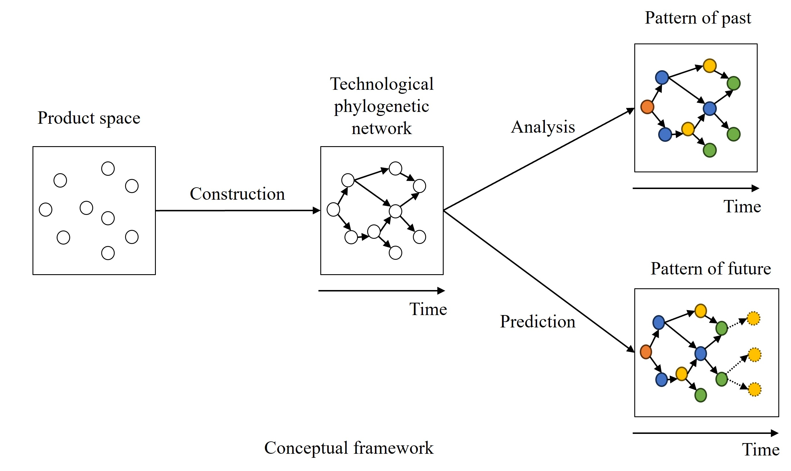

# Title
Exploring the Technological Phylogenetic Network:  Construction, Historical Analysis, and Future Predictions of Technological  Evolution  
  

# Abstract
Technological evolution, much like biological evolution, progresses through the inheritance and variation of features, driven by the process of natural selection where the fittest thrive. According to generalized Darwinism, technological evolution occurs through continuous innovation and recombination of product technologies, leading to new products and advancements. These products evolve as they undergo market selection, reflecting a process of "survival of the fittest." Great inventions often arise from "standing on the shoulders of giants," representing the cumulative nature of technological progress. By applying the theory of technological evolution, we can gain deep insights into technological change and dynamics. Phylogeny is a foundational method for studying biological evolution; however, due to the unique nature of products and technologies, this dissertation proposes a generalized approach to phylogenetic construction tailored for analyzing technological evolution. By constructing phylogenetic networks based on mobile phone data and AI-related paper fields, and comparing these with randomly rewired networks, the study validates the effectiveness of the proposed technological phylogeny approach. Furthermore, a technological phylogenetic network for automobile products enables an empirical analysis of automobile evolution, leading to the formulation of a key principle for designing disruptive products: “Small but impactful changes.” In addition, the construction of a phylogenetic tree for mobile phone products effectively identifies benchmark products and estimates the probability of new products becoming benchmark products. This research also explores the factors influencing a product's benchmark potential from a brand strategy perspective.  
# Keywords  
Phylogenetic network, Technological evolution, Phylogeny, Technology prediction  
# Presentation file  
Please see the <a href='Dissertation_presentation_heyouwei.pdf'>PDF</a> file  

